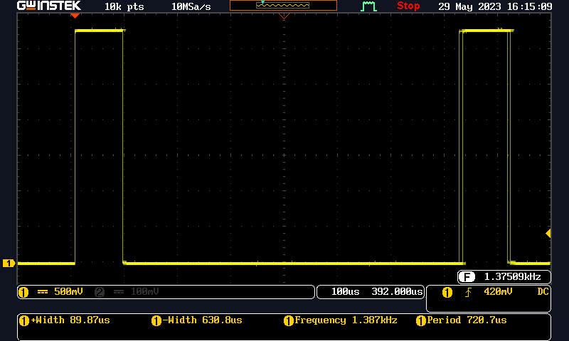
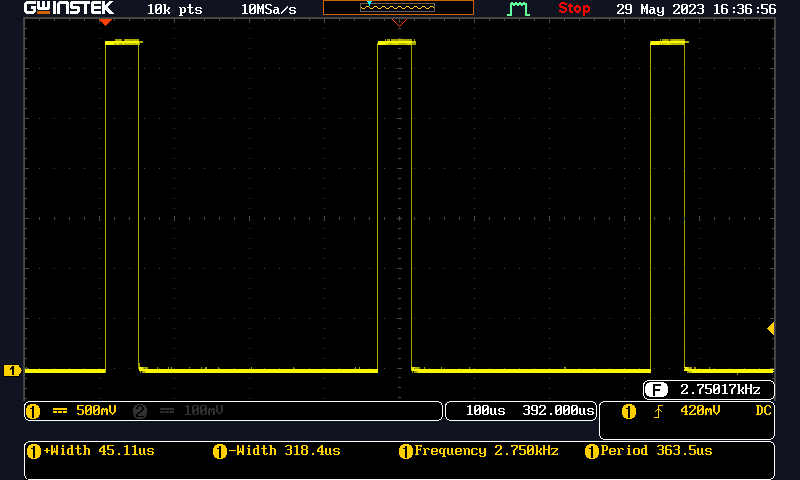

Il metodo compute, è il cuore del calcolo DSP eseguito da faust.

La sua durata determina in qualche modo l'intera efficienza del sistema.

Sul mio ESP32 WROOM32 clockato a 240MHz, questo calcolo dura intorno a 90uS.

Vedi il test point 1 (+Width) in basso a sinistra



La durata di questo calcolo dipende anche dal numero di campioni calcolati (buffer).
Nel caso precedende ad esempio questi campioni sono 32.

Se portiamo il numero di campioni a 16, la durata scende in proporzione e abbiamo una durata di 45uS



# Attenzione 1 !!

Calcolare 16 campioni in un colpo solo, significa poi doverli inviare al DAC in una unica soluzione. Questo implica che il DAC abbia un buffer size congruo. 

# Attenzione 2 !!

Notare la frequenza di aggiornamento del DAC sul test point Frequency. 

Nel caso 1 risulta 1375 Hz. Da un rapido calcolo quindi troviamo che il sample rate del sistema è 32*1375 = 44.000
Nel caso 2 risulta 2750 Hz. Da un rapido calcolo quindi troviamo che il sample rate del sistema è 16*2750 = 44.000

Quando istanziamo l'oggetto DSP di faust infatti il suo costruttore ci chiede il sample rate e la dimensione del buffer.

```js
FLRCowBell FLRCow(44000, 32);  // primo caso
...
FLRCowBell FLRCow(44000, 16);  // secondo caso

```

A parità di sample rate (44.000), con un buffer che è la metà più piccolo, è necessario che la frequenza di aggiornamento del DAC (salvo errori di misura...) raddoppi.

